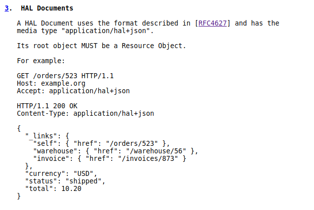

# MICRONAUT

- [MICRONAUT](#micronaut)
  - [Main page](#main-page)
  - [Download and install](#download-and-install)
  - [User guide](#user-guide)
    - [Other guides](#other-guides)
  - [Micronaut Maven plugin](#micronaut-maven-plugin)
    - [Other sources](#other-sources)
      - [Dockerize Micronaut app](#dockerize-micronaut-app)
      - [Micronaut 101 (incl. creating app with CLI)](#micronaut-101-incl-creating-app-with-cli)
      - [Automatic Autonomous Wallet Download & Configuration with Micronaut](#automatic-autonomous-wallet-download--configuration-with-micronaut)
      - [Building Java Cloud Applications with Micronaut and OCI](#building-java-cloud-applications-with-micronaut-and-oci)
  - [Communication (chats/rooms)](#communication-chatsrooms)
  - [JavaDoc](#javadoc)
  - [Examples](#examples)
  - [Kubernetes](#kubernetes)
  - [OCI Cloud](#oci-cloud)
  - [Tracing](#tracing)
  - [Other](#other)
    - [vnd.error](#vnderror)
    - [JSON Hypertext Application Language (HAL)](#json-hypertext-application-language-hal)
    - [Jib - containerize Maven application](#jib---containerize-maven-application)

## Main page

[https://micronaut.io/](https://micronaut.io/)

## Download and install
Using SDKMAN.

[https://micronaut.io/download/](https://micronaut.io/download/)

## User guide
Can be reached from [Main Page](#main-page). Can choose the version from combobox.

[https://docs.micronaut.io/latest/guide/](https://docs.micronaut.io/latest/guide/)

### Other guides

[https://micronaut.io/guides/](https://micronaut.io/guides/)
and
[https://github.com/micronaut-projects/micronaut-guides/tree/master/guides](https://github.com/micronaut-projects/micronaut-guides/tree/master/guides) (incl. Oracle ATP, Cloud)

## Micronaut Maven plugin

[https://micronaut-projects.github.io/micronaut-maven-plugin/latest/examples/package.html](https://micronaut-projects.github.io/micronaut-maven-plugin/latest/examples/package.html)

### Other sources

#### Dockerize Micronaut app
  [https://medium.com/techwasti/dockerise-micronaut-application-c387f006ea54](https://medium.com/techwasti/dockerise-micronaut-application-c387f006ea54)

#### Micronaut 101 (incl. creating app with CLI)
  [https://blog.stack-labs.com/code/introduction_to_micronaut/](https://blog.stack-labs.com/code/introduction_to_micronaut/)

#### Automatic Autonomous Wallet Download & Configuration with Micronaut
  [https://blogs.oracle.com/developers/automatic-autonomous-wallet-download-configuration-with-micronaut](https://blogs.oracle.com/developers/automatic-autonomous-wallet-download-configuration-with-micronaut)

#### Building Java Cloud Applications with Micronaut and OCI
Tutorial/Lab.

  [https://oracle.github.io/learning-library/developer-library/micronaut-oci-atp/workshops/freetier/](https://oracle.github.io/learning-library/developer-library/micronaut-oci-atp/workshops/freetier/)

## Communication (chats/rooms)

- Gitter
  [https://gitter.im/micronautfw/](https://gitter.im/micronautfw/)

## JavaDoc
Can be reached from [Main Page](#main-page).

[https://docs.micronaut.io/latest/api/](https://docs.micronaut.io/latest/api/)

## Examples

[https://github.com/micronaut-projects/micronaut-examples](https://github.com/micronaut-projects/micronaut-examples)

## Kubernetes
Can be reached from [Main Page](#main-page).

[https://micronaut-projects.github.io/micronaut-kubernetes/latest/guide/index.html](https://micronaut-projects.github.io/micronaut-kubernetes/latest/guide/index.html)

## OCI Cloud
Can be reached from [Main Page](#main-page).

[https://micronaut-projects.github.io/micronaut-oracle-cloud/latest/guide](https://micronaut-projects.github.io/micronaut-oracle-cloud/latest/guide)

## Tracing
Using Zipkin.

[https://blogs.oracle.com/developers/adding-tracing-to-your-distributed-cloud-native-microservices](https://blogs.oracle.com/developers/adding-tracing-to-your-distributed-cloud-native-microservices)

## Other
Other resources used by or connected to Micronaut in some way.

### vnd.error
Specification of what to return in body when error occurs. Micronaut uses this specification.

[https://github.com/blongden/vnd.error](https://github.com/blongden/vnd.error)

### JSON Hypertext Application Language (HAL)
Specification of using hyper-text links in JSON.

> Well, it's never mentioned there, but I think it is quite connected to HATEOS principles.

[https://datatracker.ietf.org/doc/html/draft-kelly-json-hal](https://datatracker.ietf.org/doc/html/draft-kelly-json-hal)

### Jib - containerize Maven application

[https://github.com/GoogleContainerTools/jib/blob/master/README.md](https://github.com/GoogleContainerTools/jib/blob/master/README.md)
and
[https://github.com/GoogleContainerTools/jib/tree/master/jib-maven-plugin](https://github.com/GoogleContainerTools/jib/tree/master/jib-maven-plugin)