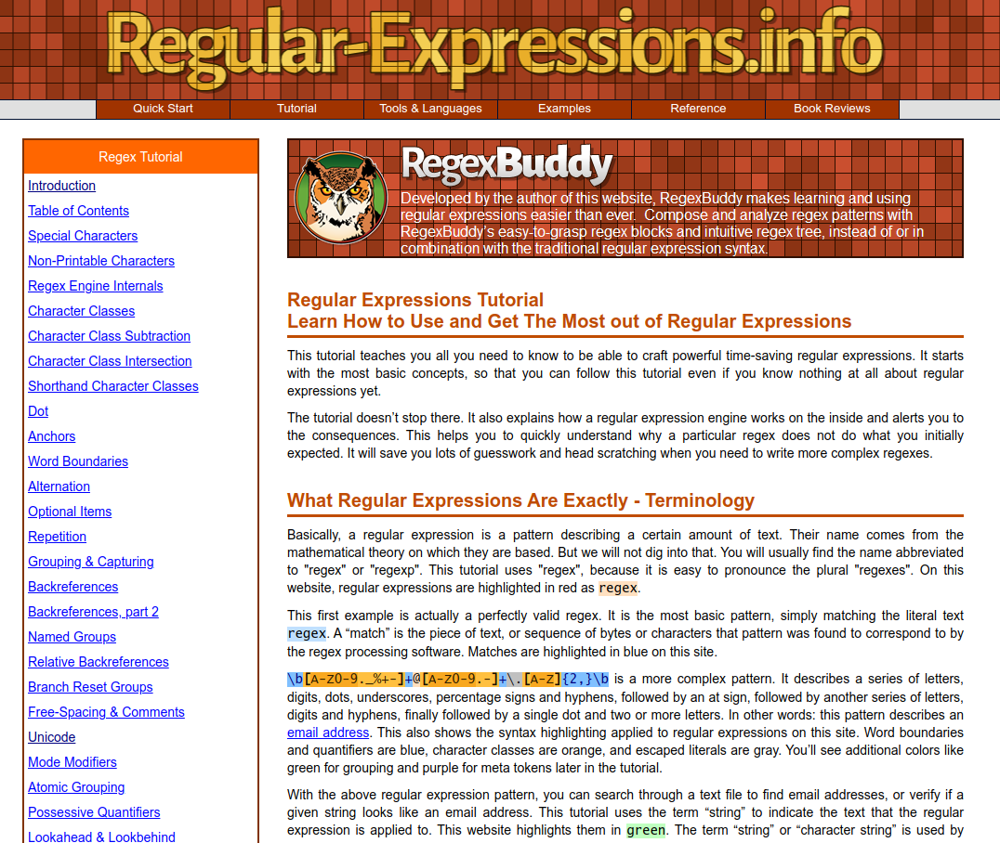
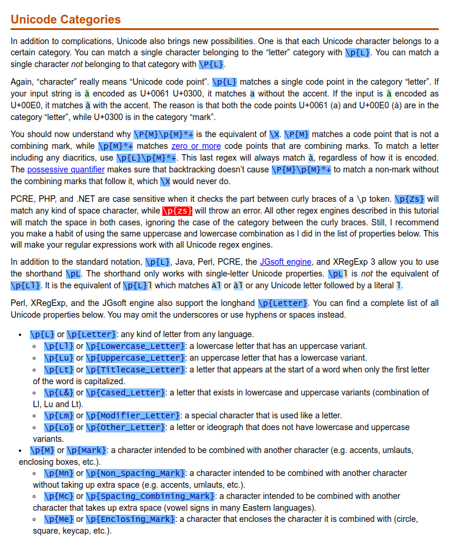
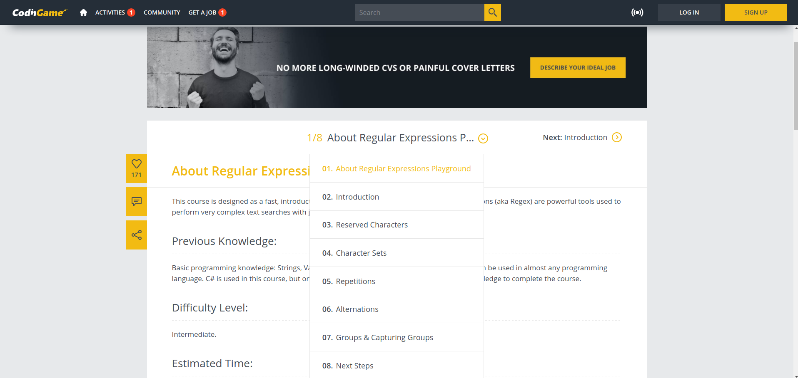
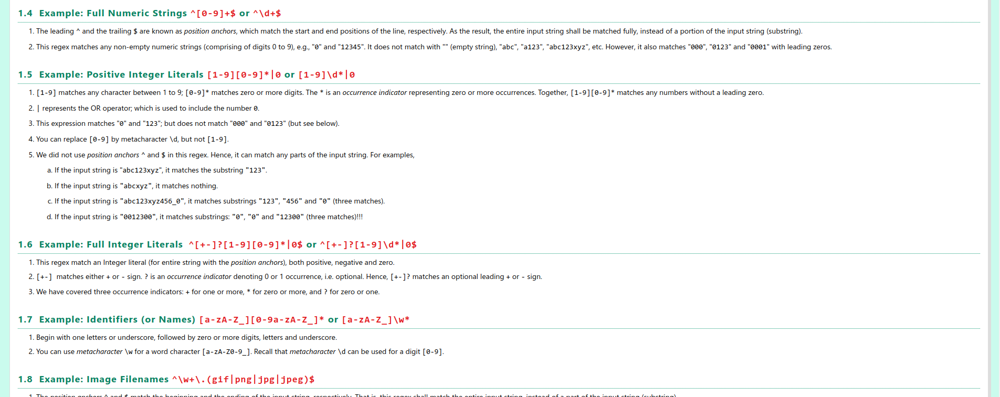

# REGEX - Regular Expressions

- [REGEX - Regular Expressions](#regex---regular-expressions)
  - [Tutorial](#tutorial)
  - [Regex Basics by CodingGame](#regex-basics-by-codinggame)
  - [HOWTO: Regex summary with examples](#howto-regex-summary-with-examples)
  - [Java Pattern class (pattern matching)](#java-pattern-class-pattern-matching)
  - [Other](#other)
    - [How to match with ignore case in Java](#how-to-match-with-ignore-case-in-java)

## Tutorial
Incl. Unicode classes.

[https://www.regular-expressions.info/tutorial.html](https://www.regular-expressions.info/tutorial.html)

## Regex Basics by CodingGame
Nicely written regex basics, for example, the reserved chars are the ones I liked.

[https://www.codingame.com/playgrounds/218/regular-expressions-basics/about-regular-expressions-playground](https://www.codingame.com/playgrounds/218/regular-expressions-basics/about-regular-expressions-playground)

## HOWTO: Regex summary with examples

[https://www3.ntu.edu.sg/home/ehchua/programming/howto/Regexe.html](https://www3.ntu.edu.sg/home/ehchua/programming/howto/Regexe.html)

## Java Pattern class (pattern matching)
Nice overview of pattern matching in Java

[https://docs.oracle.com/javase/8/docs/api/java/util/regex/Pattern.html](https://docs.oracle.com/javase/8/docs/api/java/util/regex/Pattern.html)

## Other

### How to match with ignore case in Java

[https://stackoverflow.com/a/5055036](https://stackoverflow.com/a/5055036)
