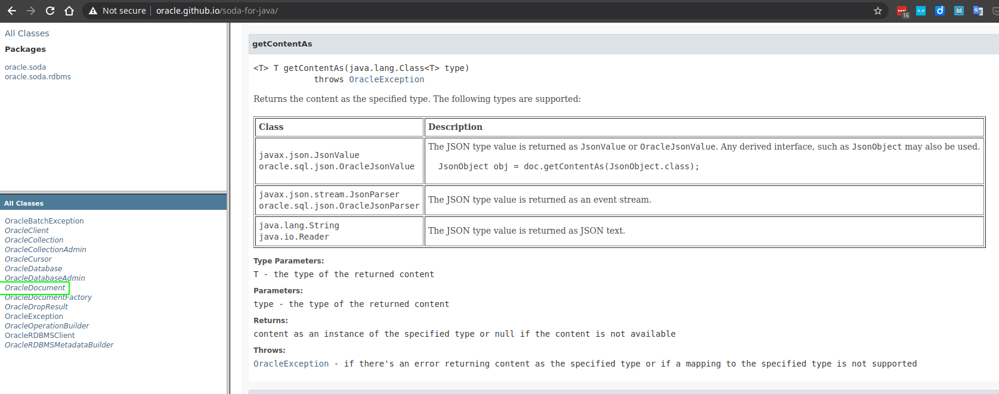

- JSON
  - [What is JSON](https://www.oracle.com/database/what-is-json/)
- Application Development
  - [Appdev JSON](https://www.oracle.com/database/technologies/appdev/json.html)
  
- Starting page
  - [Oracle Autonomous JSON Database](https://www.oracle.com/autonomous-database/autonomous-json-database/)
  - [Get Started](https://www.oracle.com/autonomous-database/autonomous-json-database/get-started/)
  - [Whitepaper](https://www.oracle.com/a/ocom/docs/autonomous-json-database-whitepaper.pdf)
  - [Documentation](https://docs.oracle.com/en/cloud/paas/autonomous-json-database/index.html)
    - [Build Java Application](https://docs.oracle.com/en/cloud/paas/autonomous-json-database/ajdug/java-application.html#GUID-9ABB8DDF-2BE9-4BAD-BD44-231D3BF98DA1)
    - [SODA](https://docs.oracle.com/en/database/oracle/simple-oracle-document-access/)
      - SQLcl
        - [Connect SQLcl](https://docs.oracle.com/en/cloud/paas/exadata-express-cloud/csdbp/connect-sqlcl.html#GUID-F78874A5-B04A-4129-A019-7752B31313D9)
        - [Use SODA from SQLcl](https://docs.oracle.com/en/cloud/paas/exadata-express-cloud/csdbp/use-soda-sqlcl.html#GUID-FE33D474-82BF-45FC-BAF7-A86C4BAB43A6)
      - Full-text search
        - [Full-Text Search Queries: Function JSON_TEXTCONTAINS](https://docs.oracle.com/en/database/oracle/oracle-database/21/adjsn/full-text-search-queries-function-json_textcontains.html#GUID-58ADCDE5-7564-4DA0-BED7-B0DBFD5AE6FB)
        - [Overview of QBE Operator $contains (Text Search)](https://docs.oracle.com/en/database/oracle/simple-oracle-document-access/adsdi/overview-soda-filter-specifications-qbes.html#GUID-42068762-5DCD-4BAE-8939-9A76C829F27E)
      - QBE
        - [Overview of SODA Filter Specifications (QBEs)](https://docs.oracle.com/en/database/oracle/simple-oracle-document-access/adsdi/overview-soda-filter-specifications-qbes.html#GUID-CB09C4E3-BBB1-40DC-88A8-8417821B0FBE)
        - [SODA Filter Specifications (Reference)](https://docs.oracle.com/en/database/oracle/simple-oracle-document-access/adsdi/soda-filter-specifications-reference.html#GUID-8DDB51EB-D80F-4476-9ABF-D6860C6214D1)
      - [SODA for Java](https://docs.oracle.com/en/database/oracle/simple-oracle-document-access/java/index.html)
        - [SODA for Java Developer's Guide](https://docs.oracle.com/en/database/oracle/simple-oracle-document-access/java/adsda/)
          - [PDF](https://docs.oracle.com/en/database/oracle/simple-oracle-document-access/java/adsda/oracle-database-soda-java-developers-guide.pdf)
        - [Using SODA for Java](https://docs.oracle.com/en/database/oracle/simple-oracle-document-access/java/adsda/using-soda-java.html#GUID-4A87EFC6-C090-47C3-B025-035DC9F1BFE0)
        - [GitHub](https://github.com/oracle/soda-for-java)
          - [Getting started with SODA for Java](https://github.com/oracle/soda-for-java/blob/master/doc/Getting-started-example.md)
            Complete starting example, with requirements specification
- Blogs
  - [Introducing Oracle Autonomous JSON Database for application developers](https://blogs.oracle.com/jsondb/autonomous-json-database)
      Beda Hammerschmidt, August 13, 2020

- Maven
  - [Coordinates](https://mvnrepository.com/artifact/com.oracle.database.soda/orajsoda/)
  ```
  <!-- https://mvnrepository.com/artifact/com.oracle.database.soda/orajsoda -->
  <dependency>
      <groupId>com.oracle.database.soda</groupId>
      <artifactId>orajsoda</artifactId>
      <version>[TBD]</version>
  </dependency>
  ```
  
- OracleDocument.getContentAs
  