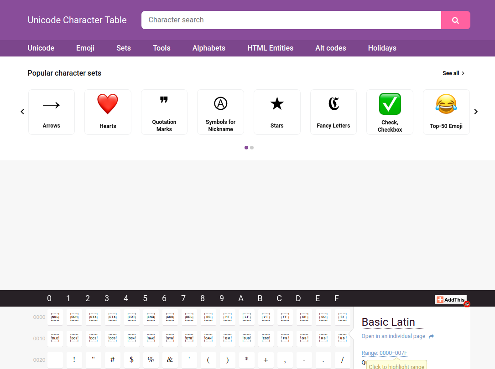
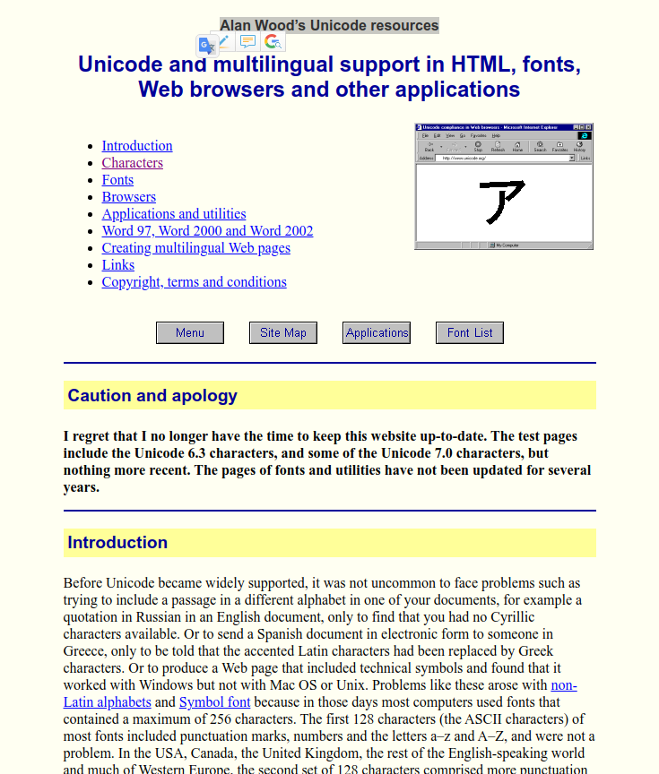
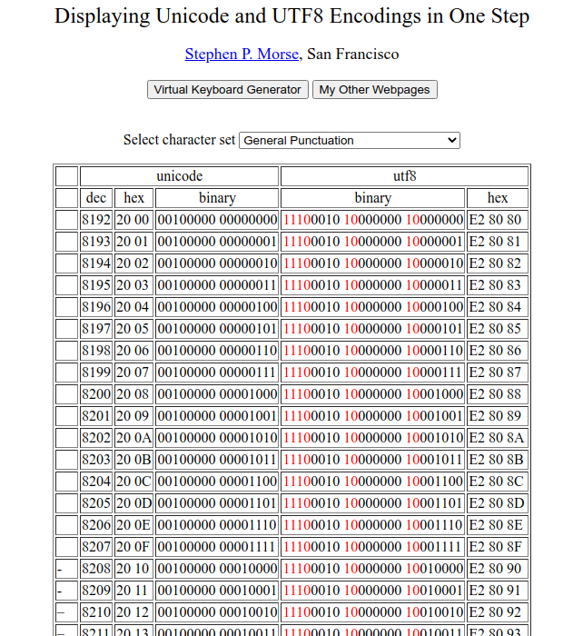
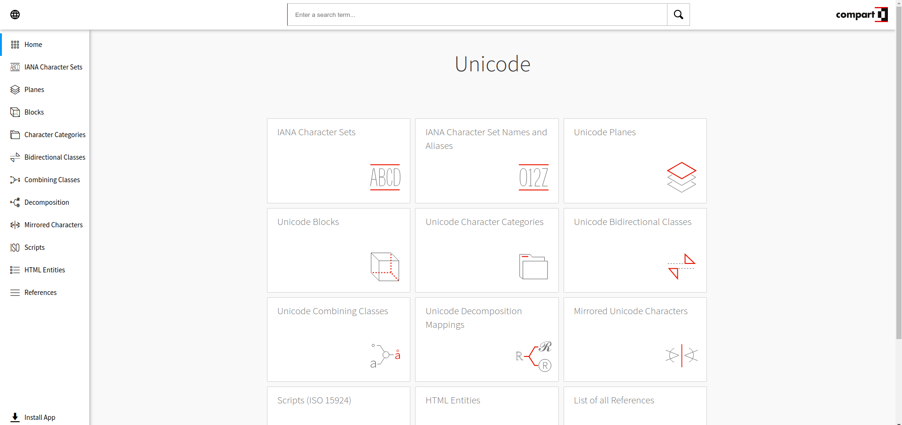
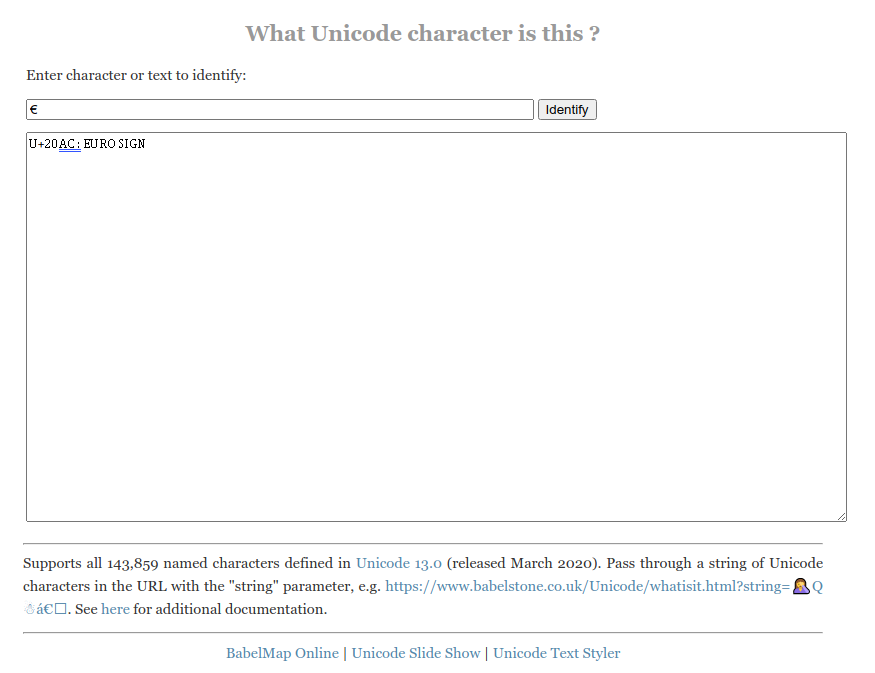

# UNICODE (UTF-8)

- [UNICODE (UTF-8)](#unicode-utf-8)
  - [Unicode Characters Search and Tables](#unicode-characters-search-and-tables)
  - [Alan Wood’s Unicode resources - Unicode and multilingual support in HTML, fonts, Web browsers and other applications](#alan-woods-unicode-resources---unicode-and-multilingual-support-in-html-fonts-web-browsers-and-other-applications)
  - [Displaying Unicode and UTF8 Encodings in One Step](#displaying-unicode-and-utf8-encodings-in-one-step)
  - [Compart - Browsable & Searcheable Unicode](#compart---browsable--searcheable-unicode)
  - [What Unicode char is it?](#what-unicode-char-is-it)

## Unicode Characters Search and Tables

[https://unicode-table.com/en/](https://unicode-table.com/en/)

## Alan Wood’s Unicode resources - Unicode and multilingual support in HTML, fonts, Web browsers and other applications

[http://www.alanwood.net/unicode/index.html](http://www.alanwood.net/unicode/index.html)

## Displaying Unicode and UTF8 Encodings in One Step
Including *Virtual Keyboard Generator*.

[https://stevemorse.org/hebrew/utf8.php?charset=39](https://stevemorse.org/hebrew/utf8.php?charset=39)

## Compart - Browsable & Searcheable Unicode

[https://www.compart.com/en/unicode/](https://www.compart.com/en/unicode/)

## What Unicode char is it?

[https://www.babelstone.co.uk/Unicode/whatisit.html](https://www.babelstone.co.uk/Unicode/whatisit.html)

