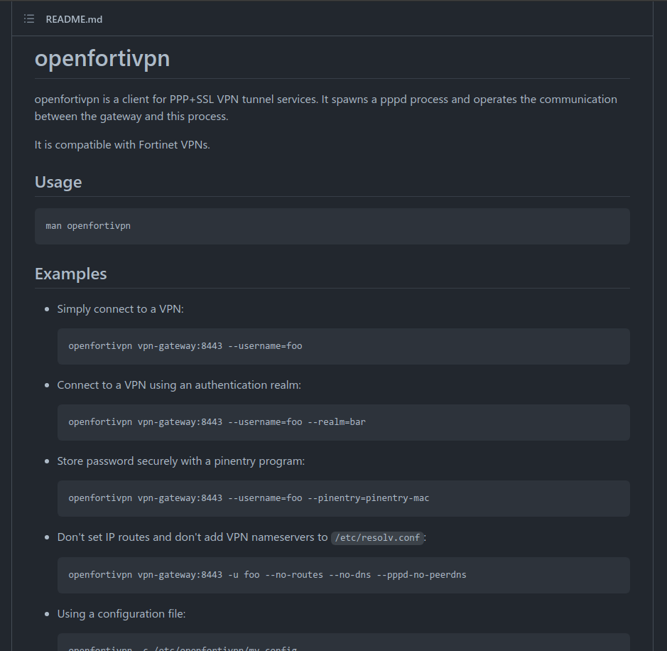

# VPN

- [VPN](#vpn)
  - [openfortivpn (Fortinet SSL)](#openfortivpn-fortinet-ssl)

## openfortivpn (Fortinet SSL)

[https://github.com/adrienverge/openfortivpn](https://github.com/adrienverge/openfortivpn)

